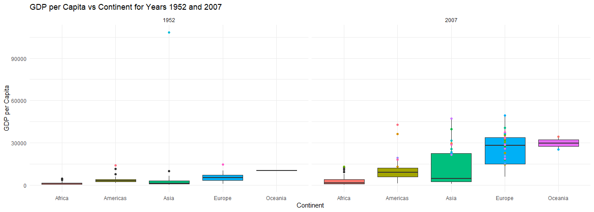

Gapminder
================
(Suwanee Li)
2025-3-2

- [Grading Rubric](#grading-rubric)
  - [Individual](#individual)
  - [Submission](#submission)
- [Guided EDA](#guided-eda)
  - [**q0** Perform your “first checks” on the dataset. What variables
    are in
    this](#q0-perform-your-first-checks-on-the-dataset-what-variables-are-in-this)
  - [**q1** Determine the most and least recent years in the `gapminder`
    dataset.](#q1-determine-the-most-and-least-recent-years-in-the-gapminder-dataset)
  - [**q2** Filter on years matching `year_min`, and make a plot of the
    GDP per capita against continent. Choose an appropriate `geom_` to
    visualize the data. What observations can you
    make?](#q2-filter-on-years-matching-year_min-and-make-a-plot-of-the-gdp-per-capita-against-continent-choose-an-appropriate-geom_-to-visualize-the-data-what-observations-can-you-make)
  - [**q3** You should have found *at least* three outliers in q2 (but
    possibly many more!). Identify those outliers (figure out which
    countries they
    are).](#q3-you-should-have-found-at-least-three-outliers-in-q2-but-possibly-many-more-identify-those-outliers-figure-out-which-countries-they-are)
  - [**q4** Create a plot similar to yours from q2 studying both
    `year_min` and `year_max`. Find a way to highlight the outliers from
    q3 on your plot *in a way that lets you identify which country is
    which*. Compare the patterns between `year_min` and
    `year_max`.](#q4-create-a-plot-similar-to-yours-from-q2-studying-both-year_min-and-year_max-find-a-way-to-highlight-the-outliers-from-q3-on-your-plot-in-a-way-that-lets-you-identify-which-country-is-which-compare-the-patterns-between-year_min-and-year_max)
- [Your Own EDA](#your-own-eda)
  - [**q5** Create *at least* three new figures below. With each figure,
    try to pose new questions about the
    data.](#q5-create-at-least-three-new-figures-below-with-each-figure-try-to-pose-new-questions-about-the-data)

*Purpose*: Learning to do EDA well takes practice! In this challenge
you’ll further practice EDA by first completing a guided exploration,
then by conducting your own investigation. This challenge will also give
you a chance to use the wide variety of visual tools we’ve been
learning.

<!-- include-rubric -->

# Grading Rubric

<!-- -------------------------------------------------- -->

Unlike exercises, **challenges will be graded**. The following rubrics
define how you will be graded, both on an individual and team basis.

## Individual

<!-- ------------------------- -->

| Category | Needs Improvement | Satisfactory |
|----|----|----|
| Effort | Some task **q**’s left unattempted | All task **q**’s attempted |
| Observed | Did not document observations, or observations incorrect | Documented correct observations based on analysis |
| Supported | Some observations not clearly supported by analysis | All observations clearly supported by analysis (table, graph, etc.) |
| Assessed | Observations include claims not supported by the data, or reflect a level of certainty not warranted by the data | Observations are appropriately qualified by the quality & relevance of the data and (in)conclusiveness of the support |
| Specified | Uses the phrase “more data are necessary” without clarification | Any statement that “more data are necessary” specifies which *specific* data are needed to answer what *specific* question |
| Code Styled | Violations of the [style guide](https://style.tidyverse.org/) hinder readability | Code sufficiently close to the [style guide](https://style.tidyverse.org/) |

## Submission

<!-- ------------------------- -->

Make sure to commit both the challenge report (`report.md` file) and
supporting files (`report_files/` folder) when you are done! Then submit
a link to Canvas. **Your Challenge submission is not complete without
all files uploaded to GitHub.**

``` r
library(tidyverse)
```

    ## ── Attaching core tidyverse packages ──────────────────────── tidyverse 2.0.0 ──
    ## ✔ dplyr     1.1.4     ✔ readr     2.1.5
    ## ✔ forcats   1.0.0     ✔ stringr   1.5.1
    ## ✔ ggplot2   3.5.1     ✔ tibble    3.2.1
    ## ✔ lubridate 1.9.4     ✔ tidyr     1.3.1
    ## ✔ purrr     1.0.2     
    ## ── Conflicts ────────────────────────────────────────── tidyverse_conflicts() ──
    ## ✖ dplyr::filter() masks stats::filter()
    ## ✖ dplyr::lag()    masks stats::lag()
    ## ℹ Use the conflicted package (<http://conflicted.r-lib.org/>) to force all conflicts to become errors

``` r
library(gapminder)
```

*Background*: [Gapminder](https://www.gapminder.org/about-gapminder/) is
an independent organization that seeks to educate people about the state
of the world. They seek to counteract the worldview constructed by a
hype-driven media cycle, and promote a “fact-based worldview” by
focusing on data. The dataset we’ll study in this challenge is from
Gapminder.

# Guided EDA

<!-- -------------------------------------------------- -->

First, we’ll go through a round of *guided EDA*. Try to pay attention to
the high-level process we’re going through—after this guided round
you’ll be responsible for doing another cycle of EDA on your own!

### **q0** Perform your “first checks” on the dataset. What variables are in this

dataset?

``` r
## TASK: Do your "first checks" here!
gapminder
```

    ## # A tibble: 1,704 × 6
    ##    country     continent  year lifeExp      pop gdpPercap
    ##    <fct>       <fct>     <int>   <dbl>    <int>     <dbl>
    ##  1 Afghanistan Asia       1952    28.8  8425333      779.
    ##  2 Afghanistan Asia       1957    30.3  9240934      821.
    ##  3 Afghanistan Asia       1962    32.0 10267083      853.
    ##  4 Afghanistan Asia       1967    34.0 11537966      836.
    ##  5 Afghanistan Asia       1972    36.1 13079460      740.
    ##  6 Afghanistan Asia       1977    38.4 14880372      786.
    ##  7 Afghanistan Asia       1982    39.9 12881816      978.
    ##  8 Afghanistan Asia       1987    40.8 13867957      852.
    ##  9 Afghanistan Asia       1992    41.7 16317921      649.
    ## 10 Afghanistan Asia       1997    41.8 22227415      635.
    ## # ℹ 1,694 more rows

``` r
?gapminder
```

    ## starting httpd help server ... done

**Observations**:

- country, continent, year, lifeExp, pop, gdpPercap

### **q1** Determine the most and least recent years in the `gapminder` dataset.

*Hint*: Use the `pull()` function to get a vector out of a tibble.
(Rather than the `$` notation of base R.)

``` r
## TASK: Find the largest and smallest values of `year` in `gapminder`

year_max <- gapminder %>% pull(year) %>% max()
year_min <- gapminder %>% pull(year) %>% min()

#year_max <- NA_real_
#year_min <- NA_real_
```

Use the following test to check your work.

``` r
## NOTE: No need to change this
assertthat::assert_that(year_max %% 7 == 5)
```

    ## [1] TRUE

``` r
assertthat::assert_that(year_max %% 3 == 0)
```

    ## [1] TRUE

``` r
assertthat::assert_that(year_min %% 7 == 6)
```

    ## [1] TRUE

``` r
assertthat::assert_that(year_min %% 3 == 2)
```

    ## [1] TRUE

``` r
if (is_tibble(year_max)) {
  print("year_max is a tibble; try using `pull()` to get a vector")
  assertthat::assert_that(False)
}

print("Nice!")
```

    ## [1] "Nice!"

### **q2** Filter on years matching `year_min`, and make a plot of the GDP per capita against continent. Choose an appropriate `geom_` to visualize the data. What observations can you make?

You may encounter difficulties in visualizing these data; if so document
your challenges and attempt to produce the most informative visual you
can.

``` r
## TASK: Create a visual of gdpPercap vs continent

filtered_data <- gapminder %>%
  filter(year == year_min)
  ggplot(filtered_data, aes(x = continent, y = gdpPercap, fill = continent)) +
  geom_boxplot() +  # Boxplot shows distribution of GDP per capita
  labs(title = paste("GDP per Capita vs Continent for Year", year_min),
       x = "Continent",
       y = "GDP per Capita") +
  theme_minimal()
```

<!-- -->

``` r
observation1 <- filtered_data %>% 
  filter(year == year_min, gdpPercap > 90000)
  observation1
```

    ## # A tibble: 1 × 6
    ##   country continent  year lifeExp    pop gdpPercap
    ##   <fct>   <fct>     <int>   <dbl>  <int>     <dbl>
    ## 1 Kuwait  Asia       1952    55.6 160000   108382.

``` r
observation2n3 <- filtered_data %>%
  filter(year == year_min, gdpPercap <= 90000)
  ggplot(observation2n3, aes(x = continent, y = gdpPercap, fill = continent)) +
  geom_boxplot() +  # Boxplot shows distribution of GDP per capita
  labs(title = paste("GDP per Capita vs Continent for Year", year_min),
       x = "Continent",
       y = "GDP per Capita") +
  theme_minimal()
```

<!-- -->

``` r
filtered_data
```

    ## # A tibble: 142 × 6
    ##    country     continent  year lifeExp      pop gdpPercap
    ##    <fct>       <fct>     <int>   <dbl>    <int>     <dbl>
    ##  1 Afghanistan Asia       1952    28.8  8425333      779.
    ##  2 Albania     Europe     1952    55.2  1282697     1601.
    ##  3 Algeria     Africa     1952    43.1  9279525     2449.
    ##  4 Angola      Africa     1952    30.0  4232095     3521.
    ##  5 Argentina   Americas   1952    62.5 17876956     5911.
    ##  6 Australia   Oceania    1952    69.1  8691212    10040.
    ##  7 Austria     Europe     1952    66.8  6927772     6137.
    ##  8 Bahrain     Asia       1952    50.9   120447     9867.
    ##  9 Bangladesh  Asia       1952    37.5 46886859      684.
    ## 10 Belgium     Europe     1952    68    8730405     8343.
    ## # ℹ 132 more rows

**Observations**:

- I notice that there is one data point that is an outlier and kuwait
  which has a GDO of 108382 which is several thousand higher than the
  others.
- Across all the continents, the average of oceania is might higher than
  the other continents as the only one that crosses 10000.
- The dispersion of Oceania is also the smallest with oceania having the
  smallest box inner quartile range.

**Difficulties & Approaches**:

- One of my challenges for this graph was being able to see the data
  well due to one outlier that scaled the data in a way that made the
  main set of data hard to see.
- The approach to find this skewed value and filter it out of the data
  before graphing.

### **q3** You should have found *at least* three outliers in q2 (but possibly many more!). Identify those outliers (figure out which countries they are).

``` r
## TASK: Identify the outliers from q2
outliers <- filtered_data %>%
  filter(year == year_min, gdpPercap > 13000)
outliers
```

    ## # A tibble: 3 × 6
    ##   country       continent  year lifeExp       pop gdpPercap
    ##   <fct>         <fct>     <int>   <dbl>     <int>     <dbl>
    ## 1 Kuwait        Asia       1952    55.6    160000   108382.
    ## 2 Switzerland   Europe     1952    69.6   4815000    14734.
    ## 3 United States Americas   1952    68.4 157553000    13990.

**Observations**:

- Identify the outlier countries from q2
  - The outliers I found were Kuwait, Switzerland and the US

*Hint*: For the next task, it’s helpful to know a ggplot trick we’ll
learn in an upcoming exercise: You can use the `data` argument inside
any `geom_*` to modify the data that will be plotted *by that geom
only*. For instance, you can use this trick to filter a set of points to
label:

``` r
## NOTE: No need to edit, use ideas from this in q4 below
gapminder %>%
  filter(year == max(year)) %>%

  ggplot(aes(continent, lifeExp)) +
  geom_boxplot() +
  geom_point(
    data = . %>% filter(country %in% c("United Kingdom", "Japan", "Zambia")),
    mapping = aes(color = country),
    size = 2
  )
```

<!-- -->

### **q4** Create a plot similar to yours from q2 studying both `year_min` and `year_max`. Find a way to highlight the outliers from q3 on your plot *in a way that lets you identify which country is which*. Compare the patterns between `year_min` and `year_max`.

*Hint*: We’ve learned a lot of different ways to show multiple
variables; think about using different aesthetics or facets.

``` r
## TASK: Create a visual of gdpPercap vs continent
filtered_data <- gapminder %>%
  filter(year == year_min | year == year_max)
outliers_data <- filtered_data %>%
  filter(gdpPercap > 13000)
  ggplot(filtered_data, aes(x = continent, y = gdpPercap, fill = continent)) +
  geom_boxplot() +  # Boxplot shows distribution of GDP per capita
  labs(
    title = paste("GDP per Capita vs Continent for Years", year_min, "and", year_max),
    x = "Continent",
    y = "GDP per Capita"
  ) +
  geom_point(
    data = outliers_data, 
    aes(color = country),
    size = 3,  # Make the outliers bigger
     shape = 17,  # Shape 21 is a filled circle
    fill = "green"  # Color of the points
  ) + 
  facet_wrap(~ year) +
  theme_minimal() +
  theme(
    # Adjust the position and size of the legend
    legend.position = "right",  # Keep the legend on the right side
    legend.key.size = unit(0.5, "cm"),  # Decrease size of legend keys (the boxes around items)
    legend.text = element_text(size = 3),  # Reduce the font size for the legend text
    legend.title = element_text(size = 9),  # Reduce font size for the legend title
    legend.box.spacing = unit(0.5, "cm"),  # Reduce the space between the legend items
    legend.margin = margin(0, 0, 0, 0),  # Reduce the margin around the legend
    legend.direction = "vertical"  # Arrange legend items vertically (default is vertical)
  )
```

<!-- -->

``` r
# observation 1
count_exceed_13000 <- gapminder %>%
  filter(year == year_min | year == year_max, gdpPercap > 13000) %>%
  group_by(year) %>%  # Group by year to count for each year separately
  summarise(count = n())
  print(count_exceed_13000)
```

    ## # A tibble: 2 × 2
    ##    year count
    ##   <int> <int>
    ## 1  1952     3
    ## 2  2007    41

``` r
# observation 3
filtered_data <- gapminder %>%
  filter(year %in% c(year_min, year_max), gdpPercap > 13000)
overlapping_countries <- filtered_data %>%
  group_by(country) %>%
  filter(n_distinct(year) == 2) %>%  # Keep only countries that appear in both years
  ungroup()
print(overlapping_countries)
```

    ## # A tibble: 6 × 6
    ##   country       continent  year lifeExp       pop gdpPercap
    ##   <fct>         <fct>     <int>   <dbl>     <int>     <dbl>
    ## 1 Kuwait        Asia       1952    55.6    160000   108382.
    ## 2 Kuwait        Asia       2007    77.6   2505559    47307.
    ## 3 Switzerland   Europe     1952    69.6   4815000    14734.
    ## 4 Switzerland   Europe     2007    81.7   7554661    37506.
    ## 5 United States Americas   1952    68.4 157553000    13990.
    ## 6 United States Americas   2007    78.2 301139947    42952.

**Observations**:

- There are a lot more values that exceed 13000 in 2007 to 1952. 2007
  has 41 countries that exceed 13000 and 1952 has 3.
- Visually from the graph many of the countries and box plot values have
  generally increased as many of the values moved upwards
- Kuwait, Switzerland and the US remain between 1952 to 2007 as
  countries with GDPs above 13000

# Your Own EDA

<!-- -------------------------------------------------- -->

Now it’s your turn! We just went through guided EDA considering the GDP
per capita at two time points. You can continue looking at outliers,
consider different years, repeat the exercise with `lifeExp`, consider
the relationship between variables, or something else entirely.

### **q5** Create *at least* three new figures below. With each figure, try to pose new questions about the data.

``` r
## TASK: Your first graph
avg_lifeExp <- gapminder %>%
  group_by(year) %>%
  summarise(avg_lifeExp = mean(lifeExp, na.rm = TRUE))
ggplot(avg_lifeExp, aes(x = year, y = avg_lifeExp)) +
  geom_line(color = "blue", size = 1) +
  labs(
    title = "Average Life Expectancy by Year",
    x = "Year",
    y = "Average Life Expectancy"
  ) +
  theme_minimal()
```

    ## Warning: Using `size` aesthetic for lines was deprecated in ggplot2 3.4.0.
    ## ℹ Please use `linewidth` instead.
    ## This warning is displayed once every 8 hours.
    ## Call `lifecycle::last_lifecycle_warnings()` to see where this warning was
    ## generated.

<!-- -->

``` r
avg_pop <- gapminder %>%
  group_by(year) %>%
  summarise(avg_pop = mean(pop, na.rm = TRUE))
ggplot(avg_pop, aes(x = year, y = avg_pop)) +
  geom_line(color = "green", size = 1) +
  scale_y_continuous(labels = scales::comma) +  # Format y-axis for readability
  labs(
    title = "Average Population by Year",
    x = "Year",
    y = "Average Population"
  ) +
  theme_minimal()
```

<!-- -->

``` r
avg_gdp <- gapminder %>%
  group_by(year) %>%
  summarise(avg_gdp = mean(gdpPercap, na.rm = TRUE))

ggplot(avg_gdp, aes(x = year, y = avg_gdp)) +
  geom_line(color = "red", size = 1) +
  scale_y_continuous(labels = scales::comma) +  # Format y-axis for readability
  labs(
    title = "Average GDP per Capita by Year",
    x = "Year",
    y = "Average GDP per Capita"
  ) +
  theme_minimal()
```

<!-- -->

- (Your notes and observations here)
- On average of all the countries it appears that average life,
  population and GDP generally have an upwards trend.
- Life expectancy has increased by at least 15 years across the last 50
  years
- Population has increased by 25,000,000 across the last 50 years
- GDP has increased by nearly 8,000 across the last 50 years

``` r
## TASK: Your second graph
filtered_data <- gapminder %>%
  filter(year == year_min | year == year_max)
# Plot using 'age' instead of 'gdpPercap' and remove the outlier filter
ggplot(filtered_data, aes(x = continent, y = lifeExp, fill = continent)) +
  geom_boxplot() +  # Boxplot shows distribution of age
  labs(
    title = paste("Life Expectancy by Continent for Years", year_min, "and", year_max),
    x = "Continent",
    y = "Life Expectancy"
  ) +
  # No outlier data to plot
  facet_wrap(~ year) +  # Facet by year
  theme_minimal()
```

<!-- -->

- (Your notes and observations here)
- From 1952 to 2007 the life expectancy appears to have gone up as the
  averages for all the box plots increased by at least 10 years.
- Oceania consistently has the highest Life expectancy rate both in 1952
  and 2007 and Africa has the lowest
- Oceania has a very low range of values as compared to the other
  continents with a very small inner quartile range judging by the size
  of the box plot being the smallest. This makes sense as it only
  includes 2 countries of Australia and New Zealand
- The order of the averages where the 50% black line for each box plot
  seems to follow the same order of who has the highest life expectancy.
  With Oceania as the highest then Europe, Americas, Asia and Africa

``` r
## TASK: Your third graph
ggplot(gapminder, aes(x = lifeExp, y = gdpPercap, color = continent)) +
  geom_point(size = 2, alpha = 0.6) +  # Scatter plot with points
  geom_smooth(method = "lm", aes(group = continent), se = FALSE, linetype = "solid", size = 3) +  # Trendline for each continent
  scale_y_log10() +  # Apply log scale for GDP on y-axis
  labs(
    title = "Life Expectancy vs GDP per Capita with Trendlines for Each Continent",
    x = "Life Expectancy",
    y = "GDP per Capita (Log Scale)"
  ) +
  coord_flip() +  # Flip the axes
  theme_minimal() +
  theme(legend.position = "right")
```

    ## `geom_smooth()` using formula = 'y ~ x'

<!-- -->

- (Your notes and observations here)
- As GDP goes up the general trend across all continents is that life
  expectancy also tends to increase
- Africa and the Americas have the steepest trend line meaning for every
  GDP per capita increae in this graph, they have the highest increase
  of life expectancy compared to the other continents
- Asia and Africa also have similar steepness rates for how they capita
  realtes to the life expectancy as they are parallel looking lines.
- Asia appears to have the greatest range of capita values throughout
  all the years as their data is the most scattered in the y direction.
