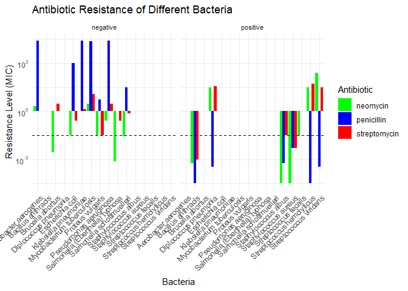
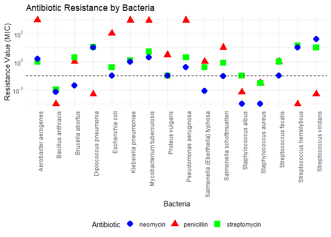
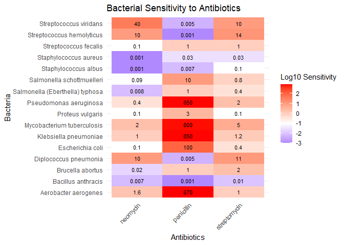
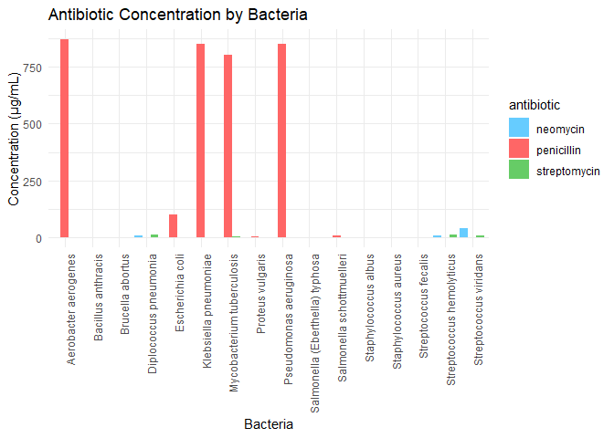
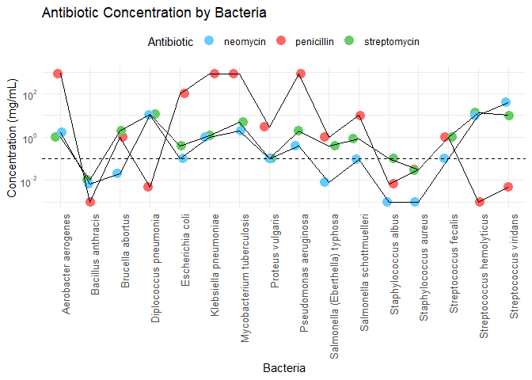

Antibiotics
================
(Suwanee Li)
2025-03-06

*Purpose*: Creating effective data visualizations is an *iterative*
process; very rarely will the first graph you make be the most
effective. The most effective thing you can do to be successful in this
iterative process is to *try multiple graphs* of the same data.

Furthermore, judging the effectiveness of a visual is completely
dependent on *the question you are trying to answer*. A visual that is
totally ineffective for one question may be perfect for answering a
different question.

In this challenge, you will practice *iterating* on data visualization,
and will anchor the *assessment* of your visuals using two different
questions.

*Note*: Please complete your initial visual design **alone**. Work on
both of your graphs alone, and save a version to your repo *before*
coming together with your team. This way you can all bring a diversity
of ideas to the table!

<!-- include-rubric -->

# Grading Rubric

<!-- -------------------------------------------------- -->

Unlike exercises, **challenges will be graded**. The following rubrics
define how you will be graded, both on an individual and team basis.

## Individual

<!-- ------------------------- -->

| Category | Needs Improvement | Satisfactory |
|----|----|----|
| Effort | Some task **q**’s left unattempted | All task **q**’s attempted |
| Observed | Did not document observations, or observations incorrect | Documented correct observations based on analysis |
| Supported | Some observations not clearly supported by analysis | All observations clearly supported by analysis (table, graph, etc.) |
| Assessed | Observations include claims not supported by the data, or reflect a level of certainty not warranted by the data | Observations are appropriately qualified by the quality & relevance of the data and (in)conclusiveness of the support |
| Specified | Uses the phrase “more data are necessary” without clarification | Any statement that “more data are necessary” specifies which *specific* data are needed to answer what *specific* question |
| Code Styled | Violations of the [style guide](https://style.tidyverse.org/) hinder readability | Code sufficiently close to the [style guide](https://style.tidyverse.org/) |

## Submission

<!-- ------------------------- -->

Make sure to commit both the challenge report (`report.md` file) and
supporting files (`report_files/` folder) when you are done! Then submit
a link to Canvas. **Your Challenge submission is not complete without
all files uploaded to GitHub.**

``` r
library(tidyverse)
```

    ## ── Attaching core tidyverse packages ──────────────────────── tidyverse 2.0.0 ──
    ## ✔ dplyr     1.1.4     ✔ readr     2.1.5
    ## ✔ forcats   1.0.0     ✔ stringr   1.5.1
    ## ✔ ggplot2   3.5.1     ✔ tibble    3.2.1
    ## ✔ lubridate 1.9.4     ✔ tidyr     1.3.1
    ## ✔ purrr     1.0.2     
    ## ── Conflicts ────────────────────────────────────────── tidyverse_conflicts() ──
    ## ✖ dplyr::filter() masks stats::filter()
    ## ✖ dplyr::lag()    masks stats::lag()
    ## ℹ Use the conflicted package (<http://conflicted.r-lib.org/>) to force all conflicts to become errors

``` r
library(ggrepel)
```

*Background*: The data\[1\] we study in this challenge report the
[*minimum inhibitory
concentration*](https://en.wikipedia.org/wiki/Minimum_inhibitory_concentration)
(MIC) of three drugs for different bacteria. The smaller the MIC for a
given drug and bacteria pair, the more practical the drug is for
treating that particular bacteria. An MIC value of *at most* 0.1 is
considered necessary for treating human patients.

These data report MIC values for three antibiotics—penicillin,
streptomycin, and neomycin—on 16 bacteria. Bacteria are categorized into
a genus based on a number of features, including their resistance to
antibiotics.

``` r
## NOTE: If you extracted all challenges to the same location,
## you shouldn't have to change this filename
filename <- "./data/antibiotics.csv"

## Load the data
df_antibiotics <- read_csv(filename)
```

    ## Rows: 16 Columns: 5
    ## ── Column specification ────────────────────────────────────────────────────────
    ## Delimiter: ","
    ## chr (2): bacteria, gram
    ## dbl (3): penicillin, streptomycin, neomycin
    ## 
    ## ℹ Use `spec()` to retrieve the full column specification for this data.
    ## ℹ Specify the column types or set `show_col_types = FALSE` to quiet this message.

``` r
df_antibiotics %>% knitr::kable()
```

| bacteria                        | penicillin | streptomycin | neomycin | gram     |
|:--------------------------------|-----------:|-------------:|---------:|:---------|
| Aerobacter aerogenes            |    870.000 |         1.00 |    1.600 | negative |
| Brucella abortus                |      1.000 |         2.00 |    0.020 | negative |
| Bacillus anthracis              |      0.001 |         0.01 |    0.007 | positive |
| Diplococcus pneumonia           |      0.005 |        11.00 |   10.000 | positive |
| Escherichia coli                |    100.000 |         0.40 |    0.100 | negative |
| Klebsiella pneumoniae           |    850.000 |         1.20 |    1.000 | negative |
| Mycobacterium tuberculosis      |    800.000 |         5.00 |    2.000 | negative |
| Proteus vulgaris                |      3.000 |         0.10 |    0.100 | negative |
| Pseudomonas aeruginosa          |    850.000 |         2.00 |    0.400 | negative |
| Salmonella (Eberthella) typhosa |      1.000 |         0.40 |    0.008 | negative |
| Salmonella schottmuelleri       |     10.000 |         0.80 |    0.090 | negative |
| Staphylococcus albus            |      0.007 |         0.10 |    0.001 | positive |
| Staphylococcus aureus           |      0.030 |         0.03 |    0.001 | positive |
| Streptococcus fecalis           |      1.000 |         1.00 |    0.100 | positive |
| Streptococcus hemolyticus       |      0.001 |        14.00 |   10.000 | positive |
| Streptococcus viridans          |      0.005 |        10.00 |   40.000 | positive |

``` r
# Variables:
# Bacteria = Name of Bacteria type being expose to antibiotic
# Penicillin = antibiotic type
# Streptomycin = antibiotic type
# neomycin = antibiotic type
# gram = + treat with penicillin & neomycin
#        - neomycin
```

# Visualization

<!-- -------------------------------------------------- -->

### **q1** Prototype 5 visuals

To start, construct **5 qualitatively different visualizations of the
data** `df_antibiotics`. These **cannot** be simple variations on the
same graph; for instance, if two of your visuals could be made identical
by calling `coord_flip()`, then these are *not* qualitatively different.

For all five of the visuals, you must show information on *all 16
bacteria*. For the first two visuals, you must *show all variables*.

*Hint 1*: Try working quickly on this part; come up with a bunch of
ideas, and don’t fixate on any one idea for too long. You will have a
chance to refine later in this challenge.

*Hint 2*: The data `df_antibiotics` are in a *wide* format; it may be
helpful to `pivot_longer()` the data to make certain visuals easier to
construct.

#### Visual 1 (All variables)

In this visual you must show *all three* effectiveness values for *all
16 bacteria*. This means **it must be possible to identify each of the
16 bacteria by name.** You must also show whether or not each bacterium
is Gram positive or negative.

``` r
# Reshape the data into long format
data_long <- df_antibiotics %>%
  pivot_longer(cols = c(penicillin, streptomycin, neomycin), 
               names_to = "antibiotic", 
               values_to = "resistance")

# Reorder antibiotics to the desired order
data_long$antibiotic <- factor(data_long$antibiotic, levels = c("neomycin", "penicillin", "streptomycin"))

# Create the bar plot with facets for Gram status
ggplot(data_long, aes(x = bacteria, y = resistance, fill = antibiotic)) +
  geom_bar(stat = "identity", position = "dodge") +
  theme_minimal() +
  labs(title = "Antibiotic Resistance of Different Bacteria",
       x = "Bacteria",
       y = "Resistance Level (MIC)",
       fill = "Antibiotic") +
  theme(axis.text.x = element_text(angle = 45, hjust = 1),
        strip.text = element_text(size = 8)) +  # Rotate x-axis labels
  facet_wrap(~ gram) +  # Facet by Gram status (positive/negative)
  scale_fill_manual(values = c("neomycin" = "green", "penicillin" = "blue", "streptomycin" = "red")) +  # Optional custom colors
  scale_y_log10(labels = scales::trans_format("log10", scales::math_format(10^.x))) +  # Log scale for MIC values
  geom_hline(yintercept = 0.1, linetype = "dashed", color = "black") # Add line for clinically important MIC value
```

<!-- -->

#### Visual 2 (All variables)

In this visual you must show *all three* effectiveness values for *all
16 bacteria*. This means **it must be possible to identify each of the
16 bacteria by name.** You must also show whether or not each bacterium
is Gram positive or negative.

Note that your visual must be *qualitatively different* from *all* of
your other visuals.

``` r
# Step 1: Pivot the data to long format
data_long <- df_antibiotics %>%
  pivot_longer(cols = c(penicillin, streptomycin, neomycin), 
               names_to = "antibiotic", 
               values_to = "resistance") %>%
  mutate(gram_status = ifelse(gram == "negative", "negative", "positive"))

# Step 2: Create a new column 'category' to define whether we are plotting Penicillin, Streptomycin, or Neomycin
data_long <- data_long %>%
  mutate(category = case_when(
    antibiotic == "penicillin" ~ "penicillin",
    antibiotic == "streptomycin" & gram_status == "positive" ~ "streptomycin_positive",
    antibiotic == "neomycin" & gram_status == "positive" ~ "neomycin_positive",
    antibiotic == "streptomycin" & gram_status == "negative" ~ "streptomycin_negative",
    antibiotic == "neomycin" & gram_status == "negative" ~ "neomycin_negative"
  ))

# Step 3: Plot the data using shape aesthetic and avoid faceting
ggplot(data_long, aes(x = bacteria, y = resistance, color = antibiotic, shape = antibiotic)) +
  geom_point(size = 4) +  # Use points for the data
  scale_color_manual(values = c("penicillin" = "red", 
                               "streptomycin" = "green", 
                               "neomycin" = "blue")) +  
  labs(title = "Antibiotic Resistance by Bacteria",
       x = "Bacteria", 
       y = "Resistance Value (MIC)",
       color = "Antibiotic", shape = "Antibiotic") +
  theme_minimal() +
  theme(axis.text.x = element_text(angle = 90, hjust = 1),  
        legend.position = "bottom") +  
  scale_y_log10(labels = scales::trans_format("log10", scales::math_format(10^.x))) +  # Log scale for MIC values
  geom_hline(yintercept = 0.1, linetype = "dashed", color = "black")
```

<!-- -->

#### vVisual 3 (Some variables)

In this visual you may show a *subset* of the variables (`penicillin`,
`streptomycin`, `neomycin`, `gram`), but you must still show *all 16
bacteria*.

Note that your visual must be *qualitatively different* from *all* of
your other visuals.

``` r
# Reshape data for heatmap
melted_data <- df_antibiotics %>% 
  pivot_longer(cols = c(penicillin, streptomycin, neomycin), 
               names_to = "Antibiotic", 
               values_to = "Sensitivity")

# Ensure that the sensitivity values are above 0, since log10(0) is undefined
melted_data <- melted_data %>% 
  mutate(Sensitivity = ifelse(Sensitivity == 0, 0.001, Sensitivity))  

# Create the heatmap plot with adjusted color scale and labels
ggplot(melted_data, aes(x = Antibiotic, y = bacteria, fill = log10(Sensitivity))) +
  geom_tile() +
  scale_fill_gradient2(low = "blue", mid = "white", high = "red", midpoint = log10(0.1), 
                       name = "Log10 Sensitivity") +  
  theme_minimal() +
  theme(axis.text.x = element_text(angle = 45, hjust = 1)) +
  labs(title = "Bacterial Sensitivity to Antibiotics", x = "Antibiotics", 
       y = "Bacteria") +
  geom_hline(yintercept = which(melted_data$bacteria == "MIC = 0.1"), 
             linetype = "dashed", color = "black") +  
  geom_text(aes(label = round(Sensitivity, 3)), color = "black", size = 3) +  
  theme(axis.text.x = element_text(angle = 45, hjust = 1))  
```

<!-- -->

#### Visual 4 (Some variables)

In this visual you may show a *subset* of the variables (`penicillin`,
`streptomycin`, `neomycin`, `gram`), but you must still show *all 16
bacteria*.

Note that your visual must be *qualitatively different* from *all* of
your other visuals.

``` r
# Calculate total concentration and the percentage of each antibiotic
# Create a long format data for plotting with raw antibiotic concentrations
df_long <- df_antibiotics %>%
  pivot_longer(cols = c(penicillin, streptomycin, neomycin),
               names_to = "antibiotic",
               values_to = "concentration")

# Plot the data
ggplot(df_long, aes(x = bacteria, y = concentration, fill = antibiotic)) +
  geom_bar(stat = "identity", position = "dodge") +
  labs(title = "Antibiotic Concentration by Bacteria",
       x = "Bacteria",
       y = "Concentration (µg/mL)") +
  theme_minimal() +
  theme(axis.text.x = element_text(angle = 90, hjust = 1)) + 
  scale_fill_manual(values = c("penicillin" = "#FF6666", 
                               "streptomycin" = "#66CC66", 
                               "neomycin" = "#66CCFF"))  
```

<!-- -->

#### Visual 5 (Some variables)

In this visual you may show a *subset* of the variables (`penicillin`,
`streptomycin`, `neomycin`, `gram`), but you must still show *all 16
bacteria*.

Note that your visual must be *qualitatively different* from *all* of
your other visuals.

``` r
# Reshape the data into long format
df_long <- df_antibiotics %>%
  select(bacteria, penicillin, streptomycin, neomycin) %>%
  pivot_longer(cols = c(penicillin, streptomycin, neomycin), 
               names_to = "antibiotic", 
               values_to = "concentration")

# Ensure that the concentration values are above 0 for log10 transformation (replace 0 with a small value)
df_long <- df_long %>%
  mutate(concentration = ifelse(concentration == 0, 0.001, concentration))

# Plot with dot plot for a different visual style
ggplot(df_long, aes(x = bacteria, y = concentration, color = antibiotic)) +
  geom_point(size = 4, position = position_jitter(width = 0.2)) +  
  labs(title = "Antibiotic Concentration by Bacteria",
       x = "Bacteria",
       y = "Concentration (mg/mL)",
       color = "Antibiotic") +
  theme_minimal() +
  theme(axis.text.x = element_text(angle = 90, hjust = 1),  
        legend.position = "top") +
  scale_color_manual(values = c("penicillin" = "#FF6666", 
                               "streptomycin" = "#66CC66", 
                               "neomycin" = "#66CCFF")) +  
  scale_y_log10(labels = scales::trans_format("log10", scales::math_format(10^.x))) +
  geom_hline(yintercept = 0.1, linetype = "dashed", color = "black", size = 0.5) +  # Prominent MIC threshold line
  stat_summary(fun = "mean", geom = "line", aes(group = antibiotic), 
               color = "black", size = 0.5, linetype = "solid") +  
  theme(axis.text.x = element_text(size = 10))
```

    ## Warning: Using `size` aesthetic for lines was deprecated in ggplot2 3.4.0.
    ## ℹ Please use `linewidth` instead.
    ## This warning is displayed once every 8 hours.
    ## Call `lifecycle::last_lifecycle_warnings()` to see where this warning was
    ## generated.

<!-- -->

### **q2** Assess your visuals

There are **two questions** below; use your five visuals to help answer
both Guiding Questions. Note that you must also identify which of your
five visuals were most helpful in answering the questions.

*Hint 1*: It’s possible that *none* of your visuals is effective in
answering the questions below. You may need to revise one or more of
your visuals to answer the questions below!

*Hint 2*: It’s **highly unlikely** that the same visual is the most
effective at helping answer both guiding questions. **Use this as an
opportunity to think about why this is.**

#### Guiding Question 1

> How do the three antibiotics vary in their effectiveness against
> bacteria of different genera and Gram stain?

*Observations* - What is your response to the question above? - (Write
your response here) - Which of your visuals above (1 through 5) is
**most effective** at helping to answer this question? - (Write your
response here) - Why? - (Write your response here)

The effectiveness of the three antibiotics (penicillin, streptomycin,
and neomycin) varies across different bacterial genera and Gram stain
types. Specifically, penicillin and neomycin show lower MIC values
against Gram-positive bacteria, indicating greater effectiveness.
Streptomycin, however, tends to have higher MIC values for Gram-negative
bacteria, making it less effective against those bacteria. On the other
hand, neomycin demonstrates a high level of effectiveness against most
Gram-positive bacteria in the dataset.

Furthermore, the log-transformed MIC scale used in several of the
visuals helps clearly highlight differences in antibiotic effectiveness,
allowing for an immediate understanding of how the three antibiotics
compare in terms of their potency across various bacteria. The threshold
of MIC = 0.1 is a crucial marker to indicate whether the antibiotics are
effective for treatment.

Visual 1 utilizes a stacked bar chart to display the MIC values of all
three antibiotics for each of the 16 bacteria, with a separate facet for
Gram-positive and Gram-negative bacteria. This allows for easy
comparison of antibiotic effectiveness across both bacterial types
(Gram-positive vs. Gram-negative) and across the different antibiotics.
The log-transformed MIC scale enhances clarity, showing both small and
large values on the same scale, while the dashed line at MIC = 0.1
clearly demarcates clinically relevant thresholds. The faceting ensures
that we can directly observe how the antibiotics perform against
different Gram stain types.

#### Guiding Question 2

In 1974 *Diplococcus pneumoniae* was renamed *Streptococcus pneumoniae*,
and in 1984 *Streptococcus fecalis* was renamed *Enterococcus fecalis*
\[2\].

> Why was *Diplococcus pneumoniae* was renamed *Streptococcus
> pneumoniae*?

*Observations* - What is your response to the question above? - (Write
your response here) - Which of your visuals above (1 through 5) is
**most effective** at helping to answer this question? - (Write your
response here) - Why? - (Write your response here)

Visual 3, a heatmap, provides a clear overview of the bacterial
sensitivity to each of the antibiotics. By focusing on the antibiotic
sensitivity values across different genera, it can help in making
inferences about how bacterial characteristics (e.g., genus and Gram
stain) influence antibiotic resistance or sensitivity. While the heatmap
itself doesn’t directly address the historical renaming, it does provide
a visual clue regarding the distinct patterns of antibiotic
effectiveness, which may have been a factor in distinguishing
*Streptococcus pneumoniae* from other genera like *Diplococcus*. A
comparison of MIC values between bacteria like *Streptococcus
pneumoniae* and *Enterococcus fecalis* (previously *Streptococcus
fecalis*) can give insights into why some bacteria have been
reclassified, based on their shared and distinct responses to
antibiotics.

# References

<!-- -------------------------------------------------- -->

\[1\] Neomycin in skin infections: A new topical antibiotic with wide
antibacterial range and rarely sensitizing. Scope. 1951;3(5):4-7.

\[2\] Wainer and Lysen, “That’s Funny…” *American Scientist* (2009)
[link](https://www.americanscientist.org/article/thats-funny)
