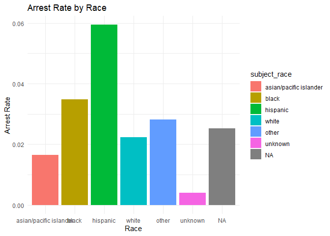
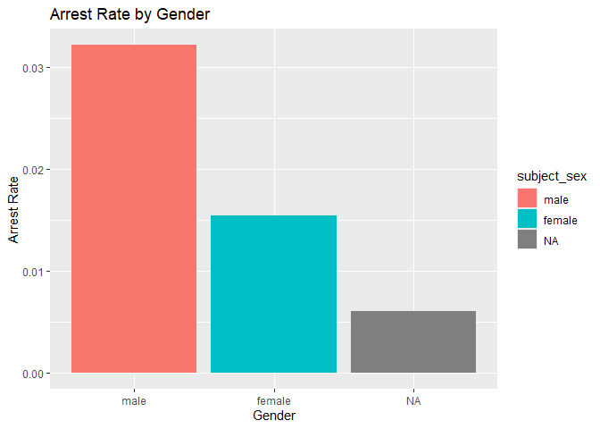
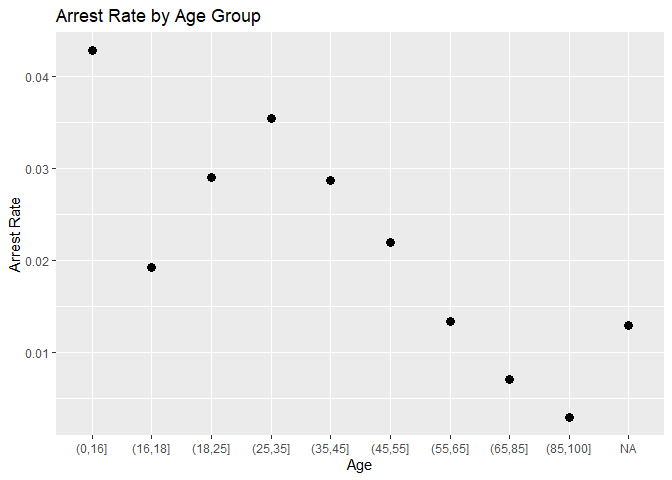

Massachusetts Highway Stops
================
(Suwanee Li)
2025-4-27

- [Grading Rubric](#grading-rubric)
  - [Individual](#individual)
  - [Submission](#submission)
- [Setup](#setup)
  - [**q1** Go to the Stanford Open Policing Project page and download
    the Massachusetts State Police records in `Rds` format. Move the
    data to your `data` folder and match the `filename` to load the
    data.](#q1-go-to-the-stanford-open-policing-project-page-and-download-the-massachusetts-state-police-records-in-rds-format-move-the-data-to-your-data-folder-and-match-the-filename-to-load-the-data)
- [EDA](#eda)
  - [**q2** Do your “first checks” on the dataset. What are the basic
    facts about this
    dataset?](#q2-do-your-first-checks-on-the-dataset-what-are-the-basic-facts-about-this-dataset)
  - [**q3** Check the set of factor levels for `subject_race` and
    `raw_Race`. What do you note about overlap / difference between the
    two
    sets?](#q3-check-the-set-of-factor-levels-for-subject_race-and-raw_race-what-do-you-note-about-overlap--difference-between-the-two-sets)
  - [**q4** Check whether `subject_race` and `raw_Race` match for a
    large fraction of cases. Which of the two hypotheses above is most
    likely, based on your
    results?](#q4-check-whether-subject_race-and-raw_race-match-for-a-large-fraction-of-cases-which-of-the-two-hypotheses-above-is-most-likely-based-on-your-results)
  - [Vis](#vis)
    - [**q5** Compare the *arrest rate*—the fraction of total cases in
      which the subject was arrested—across different factors. Create as
      many visuals (or tables) as you need, but make sure to check the
      trends across all of the `subject` variables. Answer the questions
      under *observations*
      below.](#q5-compare-the-arrest-ratethe-fraction-of-total-cases-in-which-the-subject-was-arrestedacross-different-factors-create-as-many-visuals-or-tables-as-you-need-but-make-sure-to-check-the-trends-across-all-of-the-subject-variables-answer-the-questions-under-observations-below)
- [Modeling](#modeling)
  - [**q6** Run the following code and interpret the regression
    coefficients. Answer the the questions under *observations*
    below.](#q6-run-the-following-code-and-interpret-the-regression-coefficients-answer-the-the-questions-under-observations-below)
  - [**q7** Re-fit the logistic regression from q6 setting `"white"` as
    the reference level for `subject_race`. Interpret the the model
    terms and answer the questions
    below.](#q7-re-fit-the-logistic-regression-from-q6-setting-white-as-the-reference-level-for-subject_race-interpret-the-the-model-terms-and-answer-the-questions-below)
  - [**q8** Re-fit the model using a factor indicating the presence of
    contraband in the subject’s vehicle. Answer the questions under
    *observations*
    below.](#q8-re-fit-the-model-using-a-factor-indicating-the-presence-of-contraband-in-the-subjects-vehicle-answer-the-questions-under-observations-below)
  - [**q9** Go deeper: Pose at least one more question about the data
    and fit at least one more model in support of answering that
    question.](#q9-go-deeper-pose-at-least-one-more-question-about-the-data-and-fit-at-least-one-more-model-in-support-of-answering-that-question)
  - [Further Reading](#further-reading)

*Purpose*: In this last challenge we’ll focus on using logistic
regression to study a large, complicated dataset. Interpreting the
results of a model can be challenging—both in terms of the statistics
and the real-world reasoning—so we’ll get some practice in this
challenge.

<!-- include-rubric -->

# Grading Rubric

<!-- -------------------------------------------------- -->

Unlike exercises, **challenges will be graded**. The following rubrics
define how you will be graded, both on an individual and team basis.

## Individual

<!-- ------------------------- -->

| Category | Needs Improvement | Satisfactory |
|----|----|----|
| Effort | Some task **q**’s left unattempted | All task **q**’s attempted |
| Observed | Did not document observations, or observations incorrect | Documented correct observations based on analysis |
| Supported | Some observations not clearly supported by analysis | All observations clearly supported by analysis (table, graph, etc.) |
| Assessed | Observations include claims not supported by the data, or reflect a level of certainty not warranted by the data | Observations are appropriately qualified by the quality & relevance of the data and (in)conclusiveness of the support |
| Specified | Uses the phrase “more data are necessary” without clarification | Any statement that “more data are necessary” specifies which *specific* data are needed to answer what *specific* question |
| Code Styled | Violations of the [style guide](https://style.tidyverse.org/) hinder readability | Code sufficiently close to the [style guide](https://style.tidyverse.org/) |

## Submission

<!-- ------------------------- -->

Make sure to commit both the challenge report (`report.md` file) and
supporting files (`report_files/` folder) when you are done! Then submit
a link to Canvas. **Your Challenge submission is not complete without
all files uploaded to GitHub.**

*Background*: We’ll study data from the [Stanford Open Policing
Project](https://openpolicing.stanford.edu/data/), specifically their
dataset on Massachusetts State Patrol police stops.

``` r
library(tidyverse)
```

    ## ── Attaching core tidyverse packages ──────────────────────── tidyverse 2.0.0 ──
    ## ✔ dplyr     1.1.4     ✔ readr     2.1.5
    ## ✔ forcats   1.0.0     ✔ stringr   1.5.1
    ## ✔ ggplot2   3.5.1     ✔ tibble    3.2.1
    ## ✔ lubridate 1.9.4     ✔ tidyr     1.3.1
    ## ✔ purrr     1.0.2     
    ## ── Conflicts ────────────────────────────────────────── tidyverse_conflicts() ──
    ## ✖ dplyr::filter() masks stats::filter()
    ## ✖ dplyr::lag()    masks stats::lag()
    ## ℹ Use the conflicted package (<http://conflicted.r-lib.org/>) to force all conflicts to become errors

``` r
library(broom)
```

# Setup

<!-- -------------------------------------------------- -->

### **q1** Go to the [Stanford Open Policing Project](https://openpolicing.stanford.edu/data/) page and download the Massachusetts State Police records in `Rds` format. Move the data to your `data` folder and match the `filename` to load the data.

*Note*: An `Rds` file is an R-specific file format. The function
`readRDS` will read these files.

``` r
## TODO: Download the data, move to your data folder, and load it
filename <- "data/MA_patrol.rds"
df_data <- readRDS("data/MA_patrol.rds")

# Summary statistics
summary(df_data)
```

    ##  raw_row_number          date              location         county_name       
    ##  Length:3416238     Min.   :2007-01-01   Length:3416238     Length:3416238    
    ##  Class :character   1st Qu.:2009-04-22   Class :character   Class :character  
    ##  Mode  :character   Median :2011-07-08   Mode  :character   Mode  :character  
    ##                     Mean   :2011-07-16                                        
    ##                     3rd Qu.:2013-08-27                                        
    ##                     Max.   :2015-12-31                                        
    ##                                                                               
    ##   subject_age                     subject_race     subject_sex     
    ##  Min.   :10.00    asian/pacific islander: 166842   male  :2362238  
    ##  1st Qu.:25.00    black                 : 351610   female:1038377  
    ##  Median :34.00    hispanic              : 338317   NA's  :  15623  
    ##  Mean   :36.47    white                 :2529780                   
    ##  3rd Qu.:46.00    other                 :  11008                   
    ##  Max.   :94.00    unknown               :  17017                   
    ##  NA's   :158006   NA's                  :   1664                   
    ##          type         arrest_made     citation_issued warning_issued 
    ##  pedestrian:      0   Mode :logical   Mode :logical   Mode :logical  
    ##  vehicular :3416238   FALSE:3323303   FALSE:1244039   FALSE:2269244  
    ##                       TRUE :92019     TRUE :2171283   TRUE :1146078  
    ##                       NA's :916       NA's :916       NA's :916      
    ##                                                                      
    ##                                                                      
    ##                                                                      
    ##      outcome        contraband_found contraband_drugs contraband_weapons
    ##  warning :1146078   Mode :logical    Mode :logical    Mode :logical     
    ##  citation:2171283   FALSE:28256      FALSE:36296      FALSE:53237       
    ##  summons :      0   TRUE :27474      TRUE :19434      TRUE :2493        
    ##  arrest  :  92019   NA's :3360508    NA's :3360508    NA's :3360508     
    ##  NA's    :   6858                                                       
    ##                                                                         
    ##                                                                         
    ##  contraband_alcohol contraband_other frisk_performed search_conducted
    ##  Mode :logical      Mode :logical    Mode :logical   Mode :logical   
    ##  FALSE:3400070      FALSE:51708      FALSE:51029     FALSE:3360508   
    ##  TRUE :16168        TRUE :4022       TRUE :3602      TRUE :55730     
    ##                     NA's :3360508    NA's :3361607                   
    ##                                                                      
    ##                                                                      
    ##                                                                      
    ##          search_basis     reason_for_stop    vehicle_type      
    ##  k9            :      0   Length:3416238     Length:3416238    
    ##  plain view    :      0   Class :character   Class :character  
    ##  consent       :   6903   Mode  :character   Mode  :character  
    ##  probable cause:  25898                                        
    ##  other         :  18228                                        
    ##  NA's          :3365209                                        
    ##                                                                
    ##  vehicle_registration_state   raw_Race        
    ##  MA     :3053713            Length:3416238    
    ##  CT     :  82906            Class :character  
    ##  NY     :  69059            Mode  :character  
    ##  NH     :  51514                              
    ##  RI     :  39375                              
    ##  (Other): 109857                              
    ##  NA's   :   9814

# EDA

<!-- -------------------------------------------------- -->

### **q2** Do your “first checks” on the dataset. What are the basic facts about this dataset?

**Observations**:

- What are the basic facts about this dataset?
- This data set is about police pulling over people with the columns
  - Data, location, county, age, race, sex, vehicle type, arrest status,
    citation status, warning status, outcome, contraband status,
    contraband drug status, contraband weapon status, contraband alcohol
    status, other contraband status, frisk status, search status, reason
    for stop, vehicle type, vehicle registration state, and raw Race.
- There seem to be twice as many male pull overs as female
- white gets pulled over the most, with Asian /pacific islander the
  least.
- It seems there is contraband about half the time where they are
  checked for. Drugs and Alcohol are the most common.
- I’m curious to know what raw race is? I assume, potentially, it could
  mean the race assumed at first glance by the officer

Note that we have both a `subject_race` and `race_Raw` column. There are
a few possibilities as to what `race_Raw` represents:

- `race_Raw` could be the race of the police officer in the stop
- `race_Raw` could be an unprocessed version of `subject_race`

Let’s try to distinguish between these two possibilities.

### **q3** Check the set of factor levels for `subject_race` and `raw_Race`. What do you note about overlap / difference between the two sets?

``` r
## TODO: Determine the factor levels for subject_race and raw_Race

# Get unique values for subject_race
unique(subject_race <- levels(df_data$subject_race))
```

    ## [1] "asian/pacific islander" "black"                  "hispanic"              
    ## [4] "white"                  "other"                  "unknown"

``` r
# Or if it's not a factor:
unique(subject_race <- unique(df_data$subject_race))
```

    ## [1] white                  hispanic               black                 
    ## [4] asian/pacific islander other                  <NA>                  
    ## [7] unknown               
    ## Levels: asian/pacific islander black hispanic white other unknown

``` r
# Get unique values for raw_Race
unique(raw_race <- levels(df_data$raw_Race))
```

    ## NULL

``` r
# Or if it's not a factor:
unique(raw_race <- unique(df_data$raw_Race))
```

    ## [1] "White"                                        
    ## [2] "Hispanic"                                     
    ## [3] "Black"                                        
    ## [4] "Asian or Pacific Islander"                    
    ## [5] "Middle Eastern or East Indian (South Asian)"  
    ## [6] "American Indian or Alaskan Native"            
    ## [7] NA                                             
    ## [8] "None - for no operator present citations only"
    ## [9] "A"

``` r
# Find overlap between the two sets
intersect(subject_race, raw_race)
```

    ## [1] NA

``` r
# Find differences
setdiff(subject_race, raw_race)  # Values in subject_race but not raw_Race
```

    ## [1] "white"                  "hispanic"               "black"                 
    ## [4] "asian/pacific islander" "other"                  "unknown"

``` r
setdiff(raw_race, subject_race)  # Values in raw_Race but not subject_race
```

    ## [1] "White"                                        
    ## [2] "Hispanic"                                     
    ## [3] "Black"                                        
    ## [4] "Asian or Pacific Islander"                    
    ## [5] "Middle Eastern or East Indian (South Asian)"  
    ## [6] "American Indian or Alaskan Native"            
    ## [7] "None - for no operator present citations only"
    ## [8] "A"

**Observations**:

- What are the unique values for `subject_race`?
  - Asian/Pacific islander, black , Hispanic, white, other and unknown
- What are the unique values for `raw_Race`?
  - White, Hispanic, Black, Asian or pacific islander, middle eastern or
    east Indian (south Asian), american Indian or Alaskan native, None -
    for no operator present citations only or A
- What is the overlap between the two sets?
  - white, hispanic, asian/pacific islander, black,
- What is the difference between the two sets?
  - unknown and other for subject_race, and middle eastern or east
    Indian (south Asian), american Indian or Alaskan native, None - for
    no operator present citations only or A for raw_race.

### **q4** Check whether `subject_race` and `raw_Race` match for a large fraction of cases. Which of the two hypotheses above is most likely, based on your results?

*Note*: Just to be clear, I’m *not* asking you to do a *statistical*
hypothesis test.

``` r
## TODO: Devise your own way to test the hypothesis posed above.

# Compare after standardizing case
mean(tolower(df_data$raw_Race) == df_data$subject_race, na.rm = TRUE)
```

    ## [1] 0.9429308

``` r
table(raw_Race = df_data$raw_Race, subject_race = df_data$subject_race, useNA = "always")
```

    ##                                                subject_race
    ## raw_Race                                        asian/pacific islander   black
    ##   A                                                                  0       0
    ##   American Indian or Alaskan Native                                  0       0
    ##   Asian or Pacific Islander                                     102292       0
    ##   Black                                                              0  351610
    ##   Hispanic                                                           0       0
    ##   Middle Eastern or East Indian (South Asian)                    64550       0
    ##   None - for no operator present citations only                      0       0
    ##   White                                                              0       0
    ##   <NA>                                                               0       0
    ##                                                subject_race
    ## raw_Race                                        hispanic   white   other
    ##   A                                                    0       0       2
    ##   American Indian or Alaskan Native                    0       0   11006
    ##   Asian or Pacific Islander                            0       0       0
    ##   Black                                                0       0       0
    ##   Hispanic                                        338317       0       0
    ##   Middle Eastern or East Indian (South Asian)          0       0       0
    ##   None - for no operator present citations only        0       0       0
    ##   White                                                0 2529780       0
    ##   <NA>                                                 0       0       0
    ##                                                subject_race
    ## raw_Race                                        unknown    <NA>
    ##   A                                                   0       0
    ##   American Indian or Alaskan Native                   0       0
    ##   Asian or Pacific Islander                           0       0
    ##   Black                                               0       0
    ##   Hispanic                                            0       0
    ##   Middle Eastern or East Indian (South Asian)         0       0
    ##   None - for no operator present citations only   17017       0
    ##   White                                               0       0
    ##   <NA>                                                0    1664

**Observations**

Between the two hypotheses:

- `race_Raw` could be the race of the police officer in the stop
- `race_Raw` could be an unprocessed version of `subject_race`

which is most plausible, based on your results?

- 0.9429308 or 94.3% of the data overlaps. It is likely that race_raw is
  the unprocessed version of subject_race as the race of the police
  officer should not matter to the person getting pulled over. Thus they
  are expected to have a lower matching rate. This is not the case here.

## Vis

<!-- ------------------------- -->

### **q5** Compare the *arrest rate*—the fraction of total cases in which the subject was arrested—across different factors. Create as many visuals (or tables) as you need, but make sure to check the trends across all of the `subject` variables. Answer the questions under *observations* below.

(Note: Create as many chunks and visuals as you need)

``` r
df_data$arrest_binary <- as.numeric(df_data$arrest_made == TRUE)  
# Convert to 1/0

# Calculate arrest rate by subject_race
arrest_race <- df_data %>%
  group_by(subject_race) %>%
  summarise(
    arrest_rate = mean(arrest_binary, na.rm = TRUE),
    total_stops = n()
  )

# Plot
ggplot(arrest_race, aes(x = subject_race, y = arrest_rate, fill = subject_race)) +
  geom_bar(stat = "identity") +
  labs(title = "Arrest Rate by Race", x = "Race", y = "Arrest Rate") +
  theme_minimal()
```

<!-- -->

``` r
arrest_sex <- df_data %>%
  group_by(subject_sex) %>%
  summarise(
    arrest_rate = mean(arrest_binary, na.rm = TRUE),
    total_stops = n()
  )

ggplot(arrest_sex, aes(x = subject_sex, y = arrest_rate, fill = subject_sex)) +
  geom_bar(stat = "identity") +
  labs(title = "Arrest Rate by Gender", x = "Gender", y = "Arrest Rate")
```

<!-- -->

``` r
df_data$age_group <- cut(df_data$subject_age, breaks = c(0, 16, 18, 25, 35, 45, 55, 65, 85, 100))

arrest_age <- df_data %>%
  group_by(age_group) %>%
  summarise(
    arrest_rate = mean(arrest_binary, na.rm = TRUE),
    total_stops = n()
  )

ggplot(arrest_age, aes(x = age_group, y = arrest_rate)) +
  geom_point(size = 3) +
  labs(title = "Arrest Rate by Age Group", x = "Age", y = "Arrest Rate")
```

<!-- -->

**Observations**:

- How does `arrest_rate` tend to vary with `subject_age`?
  - Arrest rate for ages 0-16 is the highest among my age groups. After
    16 there is a large drop in arrest rate As you go from 16-18 to
    25-30 the arrest rate increases. But then after, it decreases.
- How does `arrest_rate` tend to vary with `subject_sex`?
  - Male arrest rates double female arrest rates and are 5 times as high
    as the NA column.
- How does `arrest_rate` tend to vary with `subject_race`?
  - Hispanic is the highest, followed by black, other, NA, white,
    asian/pacific islander then unknown.

# Modeling

<!-- -------------------------------------------------- -->

We’re going to use a model to study the relationship between `subject`
factors and arrest rate, but first we need to understand a bit more
about *dummy variables*

### **q6** Run the following code and interpret the regression coefficients. Answer the the questions under *observations* below.

``` r
## NOTE: No need to edit; inspect the estimated model terms.
fit_q6 <-
  glm(
    formula = arrest_made ~ subject_age + subject_race + subject_sex,
    data = df_data %>%
      filter(
        !is.na(arrest_made),
        subject_race %in% c("white", "black", "hispanic")
      ),
    family = "binomial"
  )

fit_q6 %>% tidy()
```

    ## # A tibble: 5 × 5
    ##   term                 estimate std.error statistic   p.value
    ##   <chr>                   <dbl>     <dbl>     <dbl>     <dbl>
    ## 1 (Intercept)           -2.67    0.0132      -202.  0        
    ## 2 subject_age           -0.0142  0.000280     -50.5 0        
    ## 3 subject_racehispanic   0.513   0.0119        43.3 0        
    ## 4 subject_racewhite     -0.380   0.0103       -37.0 3.12e-299
    ## 5 subject_sexfemale     -0.755   0.00910      -83.0 0

**Observations**:

- Which `subject_race` levels are included in fitting the model?
  - Hispanic, White and Black are included
- Which `subject_race` levels have terms in the model?
  - Hispanic, White are have terms as Black is for reference.

You should find that each factor in the model has a level *missing* in
its set of terms. This is because R represents factors against a
*reference level*: The model treats one factor level as “default”, and
each factor model term represents a change from that “default” behavior.
For instance, the model above treats `subject_sex==male` as the
reference level, so the `subject_sexfemale` term represents the *change
in probability* of arrest due to a person being female (rather than
male).

The this reference level approach to coding factors is necessary for
[technical
reasons](https://www.andrew.cmu.edu/user/achoulde/94842/lectures/lecture10/lecture10-94842.html#why-is-one-of-the-levels-missing-in-the-regression),
but it complicates interpreting the model results. For instance; if we
want to compare two levels, neither of which are the reference level, we
have to consider the difference in their model coefficients. But if we
want to compare all levels against one “baseline” level, then we can
relevel the data to facilitate this comparison.

By default `glm` uses the first factor level present as the reference
level. Therefore we can use
`mutate(factor = fct_relevel(factor, "desired_level"))` to set our
`"desired_level"` as the reference factor.

### **q7** Re-fit the logistic regression from q6 setting `"white"` as the reference level for `subject_race`. Interpret the the model terms and answer the questions below.

``` r
## TODO: Re-fit the logistic regression, but set "white" as the reference
## level for subject_race
# Relevel 'subject_race' to make "white" the reference level
df_data <- df_data %>%
  mutate(subject_race = fct_relevel(subject_race, "white"))

# Re-fit the logistic regression model
fit_q7 <- glm(
  formula = arrest_made ~ subject_age + subject_race + subject_sex,
  data = df_data %>%
    filter(
      !is.na(arrest_made),
      subject_race %in% c("white", "black", "hispanic")
    ),
  family = "binomial"
)

# Output the tidy summary of the fitted model
fit_q7 %>% tidy()
```

    ## # A tibble: 5 × 5
    ##   term                 estimate std.error statistic   p.value
    ##   <chr>                   <dbl>     <dbl>     <dbl>     <dbl>
    ## 1 (Intercept)           -3.05    0.0109      -279.  0        
    ## 2 subject_age           -0.0142  0.000280     -50.5 0        
    ## 3 subject_raceblack      0.380   0.0103        37.0 3.12e-299
    ## 4 subject_racehispanic   0.893   0.00859      104.  0        
    ## 5 subject_sexfemale     -0.755   0.00910      -83.0 0

**Observations**:

- Which `subject_race` level has the highest probability of being
  arrested, according to this model? Which has the lowest probability?
  - According to this model Hispanic individuals have the highest
    probability of being arrested at 89.3%. White has the lowest with
    38%.
- What could explain this difference in probabilities of arrest across
  race? List **multiple** possibilities.
  - Bias in policing, socioeconomic factors, cultural assumptions,
    population diversity, and location of policing to certain areas more
    frequented by certain groups, certain repeat offenders
- Look at the set of variables in the dataset; do any of the columns
  relate to a potential explanation you listed?
  - Age could be related to arrest likelihood potentially it can be that
    youth are more likely to be arrested and there is a higher amount of
    Hispanic youth.
  - Race shows that black and Hispanic individuals are more likely to be
    arrested than white and can stem from biases in policing to target
    certain racial groups.
  - Sex shows females are less likely to be arrested, and can stem from
    possibly cultural assumptions.

One way we can explain differential arrest rates is to include some
measure indicating the presence of an arrestable offense. We’ll do this
in a particular way in the next task.

### **q8** Re-fit the model using a factor indicating the presence of contraband in the subject’s vehicle. Answer the questions under *observations* below.

``` r
## TODO: Repeat the modeling above, but control for whether contraband was found
## during the police stop

fit_q8 <- glm(
  formula = arrest_made ~ subject_age + subject_race + subject_sex + contraband_found,
  data = df_data %>%
    filter(
      !is.na(arrest_made),
      subject_race %in% c("white", "black", "hispanic"),
      !is.na(contraband_found)  # Ensure no missing values for contraband_found
    ),
  family = "binomial"
)

# Output the tidy summary of the fitted model
fit_q8 %>% tidy()
```

    ## # A tibble: 6 × 5
    ##   term                 estimate std.error statistic   p.value
    ##   <chr>                   <dbl>     <dbl>     <dbl>     <dbl>
    ## 1 (Intercept)           -1.72    0.0339      -50.8  0        
    ## 2 subject_age            0.0225  0.000866     26.0  2.19e-149
    ## 3 subject_raceblack     -0.0511  0.0270       -1.90 5.80e-  2
    ## 4 subject_racehispanic   0.221   0.0237        9.31 1.32e- 20
    ## 5 subject_sexfemale     -0.306   0.0257      -11.9  1.06e- 32
    ## 6 contraband_foundTRUE   0.609   0.0192       31.7  4.29e-221

**Observations**:

- How does controlling for found contraband affect the `subject_race`
  terms in the model?
  - For black individuals, before contraband, they are more likely to be
    arrested, but after factoring it in, it suggests the arrest
    likelihood becomes weaker and comparable to white arrest rates. For
    Hispanic individuals even after controlling for contraband, Hispanic
    individuals are still more likelyto be arrested than white
    indivudals. So race still plays a role.
- What does the *finding of contraband* tell us about the stop? What
  does it *not* tell us about the stop?
  - It tells us that higher arrest rates occur when there is contraband
    found
  - It does not tell us why the person was stopped and if it was a fair
    stop in that pulling over one group more often given the same amount
    of likelihood for contraband may result in one group having more
    arrests.

### **q9** Go deeper: Pose at least one more question about the data and fit at least one more model in support of answering that question.

**Observations**:

``` r
# Logistic regression model with interaction between race and contraband_found
fit_q9 <- glm(
  formula = arrest_made ~ subject_age + subject_sex + subject_race * contraband_found,
  data = df_data %>%
    filter(
      !is.na(arrest_made),
      subject_race %in% c("white", "black", "hispanic"),
      !is.na(contraband_found)  # Ensure no missing values for contraband_found
    ),
  family = "binomial"
)

# Output the tidy summary of the fitted model
fit_q9 %>% tidy()
```

    ## # A tibble: 8 × 5
    ##   term                                    estimate std.error statistic   p.value
    ##   <chr>                                      <dbl>     <dbl>     <dbl>     <dbl>
    ## 1 (Intercept)                              -1.71    0.0352     -48.7   0        
    ## 2 subject_age                               0.0225  0.000866    26.0   9.32e-149
    ## 3 subject_sexfemale                        -0.307   0.0257     -11.9   7.58e- 33
    ## 4 subject_raceblack                        -0.0334  0.0397      -0.840 4.01e-  1
    ## 5 subject_racehispanic                      0.168   0.0338       4.97  6.72e-  7
    ## 6 contraband_foundTRUE                      0.591   0.0241      24.5   5.40e-133
    ## 7 subject_raceblack:contraband_foundTRUE   -0.0341  0.0538      -0.632 5.27e-  1
    ## 8 subject_racehispanic:contraband_foundT…   0.105   0.0471       2.23  2.61e-  2

- How does presence of contraband interact with race in influecing the
  likelihood of an arrest?
- Findings
- subject_raceblack: -0. 0334 suggest black individuals have a slightly
  lower probability than white. with a not significant p-value.
- subject_racehispanic is 0.1680 with a significant p-value and so they
  are still more likely to be arrested
- contraband_foundTRUE: has a coefficient of 0.5911 indicating that
  finding contraband significantly increases likelihood of arrest with a
  very significant p value.
- interactions between black and contraband found true is -0.0341 and
  not statistically significant suggesting the effect of finding
  contraband on arrest likelihood is similar in black and white.
- interactions between hispanic and contraband is found to be 0.1049
  which also has a statistically significant p value. Indicating that
  contraband on arrest likelihood is stronger for Hispanic than white
  individuals.

## Further Reading

<!-- -------------------------------------------------- -->

- Stanford Open Policing Project
  [findings](https://openpolicing.stanford.edu/findings/).
